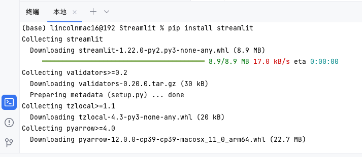
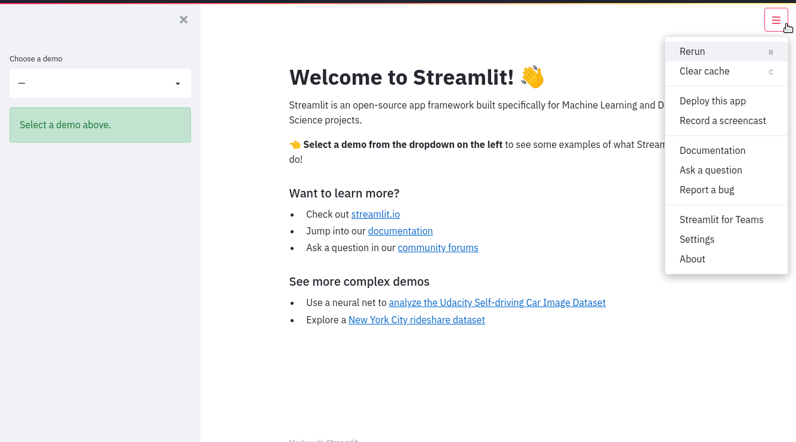

# Streamlit
Streamlit 的一些尝试和分享


## 安装

打开命令行，执行如下的命令，可以安装 Streamlit

```shell
pip install streamlit
```



## Hello

执行如下的命令可以看到官方的演示，你也可以通过这个操作来直观的感受到 Streamlit 的小魅力

```shell
streamlit hello
```


## 快速启动

### 一个小例子

创建一个新文件 streamlit_app.py，代码如下：

```pyhton
import streamlit as st
x = st.slider("Select a value")
st.write(x, "squared is", x * x)
```
现在，在控制台中，运行如下命令来打开应用程序!

```shell
streamlit run streamlit_app.py
```

包含了如下的示例：

1. 动画
2. 绘图
3. 地图绘图
4. DataFrame

## 如何使用

使用Streamlit很简单。首先，您将一些Streamlit命令洒到一个普通的Python脚本中，然后使用streamlit run运行它:

```shell
streamlit run your_script.py [-- script args]
```

运行如上所示的脚本后，本地Streamlit服务器将启动，并且您的应用程序将在默认web浏览器的新选项卡中打开。该应用程序是您的画布，您将在其中绘制图表，文本，小部件，表格等。

在应用程序中画什么由你决定。例如，st.text将原始文本写入你的应用程序，而st.line_chart则绘制--你猜对了--一个线形图。请参考我们的API文档，看看所有可用的命令。

当向你的脚本传递一些自定义参数时，它们必须在两个破折号(--)之后传递。否则，这些参数会被解释为Streamlit本身的参数。

## 开发流程

每次要更新应用程序时，请保存源文件。当您这样做时，Streamlit会检测是否有更改，并询问您是否要重新运行您的应用程序。选择屏幕右上角的 “始终重新运行”，以在每次更改其源代码时自动更新应用程序。

这让你可以在一个快速的交互式循环中工作: 你键入一些代码，保存它，实时试用，然后键入更多的代码，保存它，试用它，等等，直到你对结果满意为止。编码和实时查看结果之间的紧密循环是Streamlit使您的生活更轻松的方式之一。

> 在开发Streamlit应用程序时，建议并排放置您的编辑器和浏览器窗口，以便可以同时看到代码和应用程序。试试看!


## 数据流

Streamlit的架构允许你以编写普通Python脚本的方式来编写应用程序。为了解开这个问题，Streamlit应用程序有一个独特的数据流：任何时候屏幕上的东西必须被更新，Streamlit会从上到下重新运行你的整个Python脚本。
这可能发生在两种情况下：

* 每当你修改你的应用程序的源代码时。
* 每当用户与应用程序中的小工具进行交互时。例如，当拖动滑块，在输入框中输入文本，或点击按钮时。

每当一个回调通过on_change（或on_click）参数传递给一个widget时，回调将总是在你的脚本的其余部分之前运行。关于回调API的细节，请参考我们的会话状态API参考指南。
为了使所有这一切快速而无缝，Streamlit在幕后为你做了一些繁重的工作。这个故事中的一个重要角色是@st.cache_data装饰器，它允许开发者在他们的应用程序重新运行时跳过某些昂贵的计算。我们将在本页面的后面介绍缓存。

## 显示和样式数据

有几种方法可以在Streamlit应用程序中显示数据 (表，数组，数据帧)。

下面，将向您介绍magic和st.write()，它可以用于编写从文本到表格的任何内容。

之后，让我们看一下专门为可视化数据而设计的方法。

### 使用魔法

您也可以写入您的应用程序，而无需调用任何Streamlit方法。

Streamlit支持 “魔术命令(magic commands)”，这意味着您根本不必使用st.write()!

要看到这在行动尝试这个片段:

```python
"""
# My first app
Here's our first attempt at using data to create a table:
"""

import streamlit as st
import pandas as pd
df = pd.DataFrame({
  'first column': [1, 2, 3, 4],
  'second column': [10, 20, 30, 40]
})

df
```
你可以使用 `streamlit run DisplayAndStyleData1.py`


任何时候，当Streamlit在**单独行**中看到一个变量或一个字面值时，它就会自动用st.write()把它写到你的应用程序中。

欲了解更多信息，请参考魔法命令的文档。

### 操作DataFrame
除了神奇的命令之外，st.write()是Streamlit的 "瑞士军刀"。

你几乎可以向st.write()传递任何东西：文本、数据、Matplotlib数字、Altair图表，等等。

不要担心，Streamlit会弄清楚并以正确的方式呈现。

```python
import streamlit as st
import pandas as pd

st.write("Here's our first attempt at using data to create a table:")

df = pd.DataFrame({
    'first column': [1, 2, 3, 4],
    'second column': [10, 20, 30, 40]
})

st.write(df)

st.write("Here's our first attempt at using data to create a table using st.table:")

st.table(df)
```


还有其他一些特定的数据函数，如st.dataframe()和st.table()，你也可以用来显示数据。

让我们了解一下何时使用这些功能，以及如何为你的数据框架添加颜色和样式。

你可能会问自己，"为什么我不总是使用st.write()？" 有几个原因：

* Magic和st.write()检查你传入的数据类型，然后决定如何在应用程序中最好地呈现它。有时你想用另一种方式来绘制它。例如，你可能想用st.table(df)来画一个静态的表格，而不是把数据帧画成一个交互式的表格。
* 第二个原因是其他方法返回一个可以使用和修改的对象，可以向它添加数据或替换它。
* 最后，如果你使用一个更具体的Streamlit方法，你可以传递额外的参数来定制其行为。


例如，让我们创建一个数据框，并用Pandas Styler对象来改变其格式。在这个例子中，你将使用Numpy来生成一个随机样本，并使用st.dataframe()方法来绘制一个交互式表格。

> 这个例子使用Numpy来生成随机样本，但是你可以使用Pandas DataFrames、Numpy数组或者普通的Python数组。

让我们扩展第一个例子，使用Pandas Styler对象来突出交互式表格中的一些元素。

```python
import streamlit as st
import numpy as np
import pandas as pd

dataframe = pd.DataFrame(
    np.random.randn(10, 20),
    columns=('col %d' % i for i in range(20)))

st.dataframe(dataframe.style.highlight_max(axis=0))
```


Streamlit也有一个生成静态表的方法：st.table()。

```python
import streamlit as st
import numpy as np
import pandas as pd

dataframe = pd.DataFrame(
    np.random.randn(10, 20),
    columns=('col %d' % i for i in range(20)))
st.table(dataframe)
```

## 绘制图表和地图

Streamlit支持几个流行的数据图表库，如[Matplotlib、Altair、deck.gl等](https://docs.streamlit.io/library/api-reference#chart-elements)。

在本节中，您将向应用程序添加条形图、折线图和地图。

### 绘制折线图

您可以使用[st.line_chart()](https://docs.streamlit.io/library/api-reference/charts/st.line_chart) 轻松地将折线图添加到您的应用程序中。我们将使用Numpy生成一个随机样本，然后绘制图表。

```python
import streamlit as st
import numpy as np
import pandas as pd

chart_data = pd.DataFrame(
     np.random.randn(20, 3),
     columns=['a', 'b', 'c'])

st.line_chart(chart_data)
```


### 绘制地图

使用st.map()，您可以在地图上显示数据点。让我们使用Numpy生成一些示例数据，并将其绘制在旧金山的地图上。

```python
import streamlit as st
import numpy as np
import pandas as pd

map_data = pd.DataFrame(
    np.random.randn(1000, 2) / [50, 50] + [37.76, -122.4],
    columns=['lat', 'lon'])

st.map(map_data)
```


## 小部件


当您将数据或模型进入要探索的状态时，可以添加小部件，例如st.slider()，st.button() 或st.selectbox()。

这真的很简单-将小部件视为变量:

```python
import streamlit as st
x = st.slider('x')  # 👈 this is a widget
st.write(x, 'squared is', x * x)
```

在第一次运行时，上面的应用程序应该输出文本 "0的平方是0"。

然后，每当用户与一个小部件互动时，Streamlit会简单地从上到下重新运行你的脚本，在此过程中把小部件的当前状态分配给你的变量。

例如，如果用户将滑块移动到10的位置，Streamlit会重新运行上面的代码，并相应地将x设置为10。所以现在你应该看到 "10的平方是100 "的文字。

如果你选择指定一个字符串作为小组件的唯一键，那么小组件也可以通过键来访问：

```python
import streamlit as st
st.text_input("Your name", key="name")

# You can access the value at any point with:
st.session_state.name
```
每个具有密钥的小组件都会自动添加到会话状态。有关会话状态、其与小组件状态的关联及其限制的更多信息，请参阅[会话状态 API 参考指南](https://docs.streamlit.io/library/api-reference/session-state)。

### 使用复选框来显示/隐藏数据

复选框的一个用例是在一个应用程序中隐藏或显示一个特定的图表或部分。st.checkbox()需要一个参数，即小组件的标签。在这个例子中，复选框被用来切换一个条件语句。

```python
import streamlit as st
import numpy as np
import pandas as pd

if st.checkbox('Show dataframe'):
    chart_data = pd.DataFrame(
       np.random.randn(20, 3),
       columns=['a', 'b', 'c'])

    chart_data
```

### 使用选择框进行选择

使用st.selectbox从一个系列中选择。你可以写上你想要的选项，或者通过一个数组或数据框架列来传递。

让我们使用我们之前创建的df数据框。

```python
import streamlit as st
import pandas as pd

df = pd.DataFrame({
    'first column': [1, 2, 3, 4],
    'second column': [10, 20, 30, 40]
    })

option = st.selectbox(
    'Which number do you like best?',
     df['first column'])

'You selected: ', option
```

## 布局/Layout

Streamlit通过st.sidebar使你的widget在左面板的侧边栏中更容易组织。

传递给st.sidebar的每个元素都被固定在左边，让用户在关注你的应用程序中的内容的同时还可以访问UI控件。

例如，如果你想在侧边栏中添加一个选择框和一个滑块，请使用st.sidebar.slider和st.sidebar.selectbox而不是st.slider和st.selectbox：

```python
import streamlit as st

# Add a selectbox to the sidebar:
add_selectbox = st.sidebar.selectbox(
    'How would you like to be contacted?',
    ('Email', 'Home phone', 'Mobile phone')
)

# Add a slider to the sidebar:
add_slider = st.sidebar.slider(
    'Select a range of values',
    0.0, 100.0, (25.0, 75.0)
)
```

除了侧边栏，Streamlit还提供了其他几种控制应用程序布局的方法。st.columns可以让你并排放置小部件，st.expander可以让你通过隐藏大型内容来节省空间。

```python
import streamlit as st

left_column, right_column = st.columns(2)
# You can use a column just like st.sidebar:
left_column.button('Press me!')

# Or even better, call Streamlit functions inside a "with" block:
with right_column:
    chosen = st.radio(
        'Sorting hat',
        ("Gryffindor", "Ravenclaw", "Hufflepuff", "Slytherin"))
    st.write(f"You are in {chosen} house!")
```

> st.echo和st.spinner目前在侧边栏或布局选项中不被支持。不过，请放心，我们目前正在努力增加对这些的支持!


## 显示进度

当向应用程序添加长时间运行的计算时，您可以使用st.progress() 实时显示状态。
首先，让我们导入时间。我们将使用time.sleep() 方法来模拟长时间运行的计算:

```python
import time
```

现在，让我们创建一个进度条:

```python
import streamlit as st
import time

'Starting a long computation...'

# Add a placeholder
latest_iteration = st.empty()
bar = st.progress(0)

for i in range(100):
  # Update the progress bar with each iteration.
  latest_iteration.text(f'Iteration {i+1}')
  bar.progress(i + 1)
  time.sleep(0.1)

'...and now we\'re done!'
```


## 主题

Streamlit支持开箱即用的浅色和深色主题。

Streamlit首先会检查用户在查看应用程序时，其操作系统和浏览器是否设置了浅色或深色模式的偏好。如果是这样，就会使用该偏好。否则，将默认应用浅色主题。

你也可以从"☰"→"设置Setting"中改变活动主题。


想要将自己的主题添加到应用程序？“设置” 菜单有一个主题编辑器，可通过单击 “编辑活动主题” 来访问。您可以使用此编辑器尝试不同的颜色，并实时查看您的应用程序更新。



当你对你的工作满意时，可以通过在[主题/theme]配置部分设置配置选项来保存主题。在你为你的应用程序定义了一个主题后，它将在主题选择器中显示为 "自定义主题"，并将被默认应用，而不是包括的浅色和深色主题。
关于定义主题时可用的选项的更多信息，可以在[主题选项](https://docs.streamlit.io/library/advanced-features/theming)文档中找到。

> 主题编辑器菜单仅在本地开发中可用。如果你已经使用Streamlit社区云部署了你的应用程序，"编辑活动主题 "按钮将不再显示在 "设置 "菜单中。

> 另一种试验不同主题颜色的方法是打开 "保存时运行 "选项，编辑config.toml文件，观察你的应用程序在应用了新的主题颜色后重新运行。

## 缓存

Streamlit缓存允许你的应用程序在从网络上加载数据、操作大型数据集或执行昂贵的计算时保持高性能。

缓存的基本思想是存储昂贵的函数调用的结果，当相同的输入再次发生时返回缓存的结果，而不是在后续的运行中调用该函数。

要在Streamlit中缓存一个函数，你需要用两个装饰器（st.cache_data和st.cache_resource）之一来装饰它：

```python
@st.cache_data
def long_running_function(param1, param2):
    return …
```

在这个例子中，用@st.cache_data装饰long_running_function告诉Streamlit，每当函数被调用时，它都会检查两件事：

* 输入参数的值（在本例中是param1和param2）。
* 函数中的代码。


如果这是Streamlit第一次看到这些参数值和函数代码，它就会运行该函数并将返回值存储在缓存中。

下一次调用相同参数和代码的函数时（例如，当用户与应用程序交互时），Streamlit将完全跳过执行该函数，而是返回缓存的值。

在开发过程中，缓存会随着函数代码的变化而自动更新，确保最新的变化反映在缓存中。

如前所述，有两个缓存装饰器:

* st.cache_data是缓存返回数据的计算的推荐方法: 从CSV加载DataFrame，转换NumPy数组，查询API或任何其他返回可序列化数据对象的函数 (str，int，float，DataFrame，数组，列表，…)。它会在每个函数调用时创建一个新的数据副本，从而可以安全地防止突变和竞争条件。st.cache_data的行为在大多数情况下是你想要的-所以如果你不确定，从st.cache_data开始，看看它是否有效!
* st.cache_resource是缓存全局资源 (如ML模型或数据库连接) 的推荐方法-您不想多次加载的不可序列化对象。使用它，您可以在应用程序的所有重新运行和会话中共享这些资源，而无需复制或重复。请注意，缓存返回值的任何突变都会直接突变缓存中的对象 (更多详细信息如下)。


关于Streamlit缓存装饰器的更多信息，它们的配置参数，以及它们的限制，见[缓存](https://docs.streamlit.io/library/advanced-features/caching)。

## 页面

随着应用程序的增长，将它们组织成多个页面变得非常有用。这使得应用程序作为一个开发者更容易管理，作为一个用户更容易浏览。Streamlit提供了一种无摩擦的方式来创建多页应用。

我们设计了这一功能，所以建立一个多页面的应用就像建立一个单页面的应用一样简单！只需在现有的应用程序中添加更多的页面，如下所示：

* 在包含你的主脚本的文件夹中，创建一个新的页面文件夹。比方说，你的主脚本被命名为main_page.py。
* 在pages文件夹中添加新的.py文件，以便为你的应用程序添加更多的页面。
* 像往常一样运行streamlit run main_page.py。

* 这就是了! main_page.py脚本现在将对应于你的应用程序的主页面。而你会在侧边栏的页面选择器中看到pages文件夹中的其他脚本。比如说：

1. main_page.py

```python
import streamlit as st

st.markdown("# Main page 🎈")
st.sidebar.markdown("# Main page 🎈")
```

2. pages/page_2.py

```python
import streamlit as st

st.markdown("# Page 2 ❄️")
st.sidebar.markdown("# Page 2 ❄️")
```

3. pages/page_3.py

```python
import streamlit as st

st.markdown("# Page 3 🎉")
st.sidebar.markdown("# Page 3 🎉")
```

现在，运行 streamlit run main_page.py 并查看你闪亮的新的多页面应用程序！


我们关于[多页面应用程序的文档](https://docs.streamlit.io/library/get-started/multipage-apps)教你如何在你的应用程序中添加页面，包括如何定义页面，结构和运行多页面应用程序，以及在页面之间导航。一旦你了解了这些基础知识，就可以创建你的[第一个多页面应用程序](https://docs.streamlit.io/library/get-started/multipage-apps/create-a-multipage-app)了


## 应用程序模型

现在你对所有单独的部分有了更多的了解，让我们来结束这个循环，回顾一下它是如何一起工作的：

* Streamlit应用程序是自上而下运行的Python脚本
* 每当用户打开指向你的应用程序的浏览器标签时，该脚本就会被重新执行。
* 在脚本执行过程中，Streamlit在浏览器中实时绘制其输出。
* 脚本使用Streamlit缓存来避免重新计算昂贵的函数，所以更新速度非常快。
* 每当用户与一个小部件互动时，你的脚本就会被重新执行，该小部件的输出值就会被设置为该次运行的新值。
* Streamlit应用程序可以包含多个页面，这些页面被定义在一个`pages`文件夹中独立的.py文件中。

